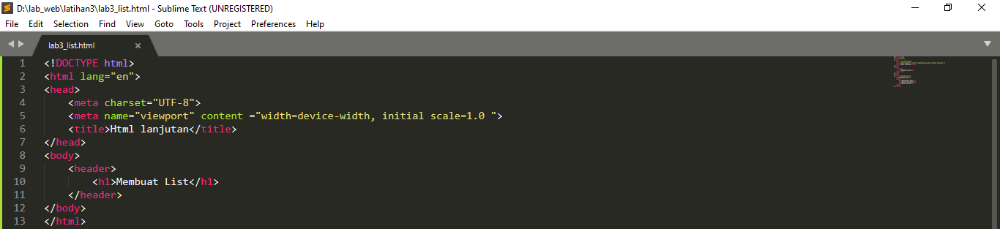
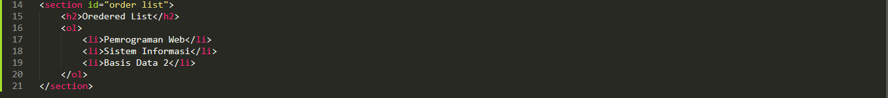
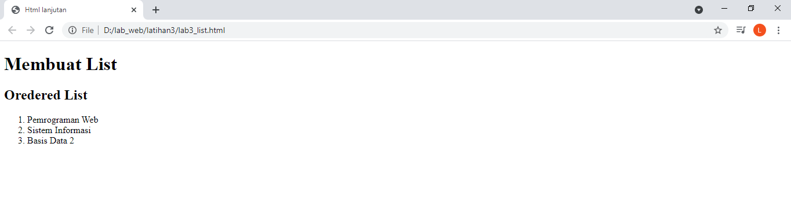
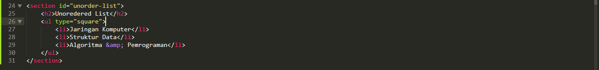
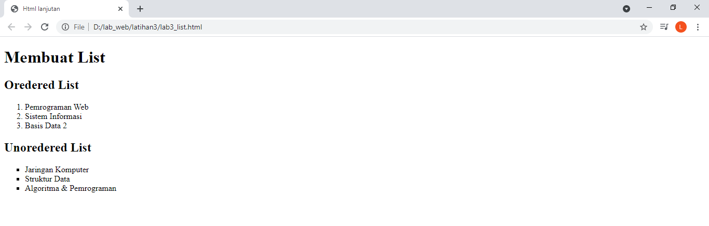
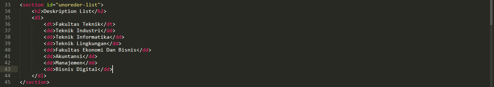
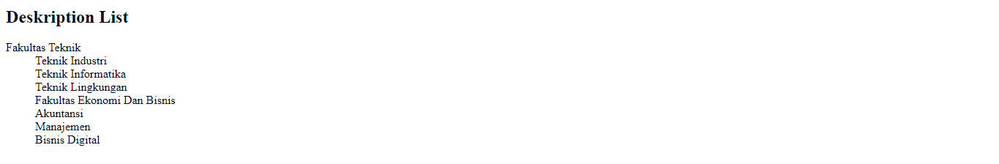
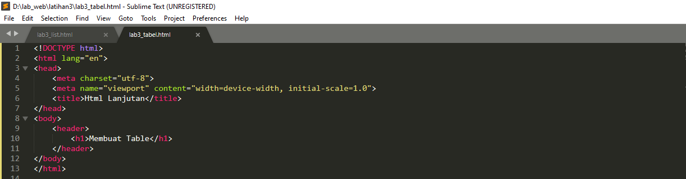
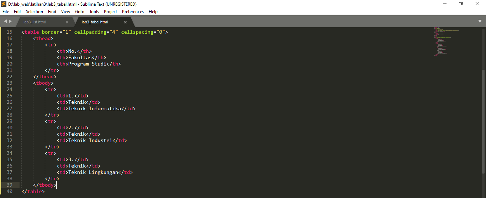
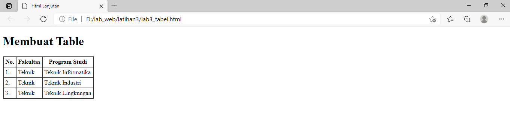

### Langkah - Langkah Pratikum

### 1. Membuat file dokumen html

### 2. Membuat Ordered List

Tambahkan kode untuk membuat ordered list

Buka Chrome dan liat hasilnya.

### 3. Membuat Unordered List

Kemudian tambakan kode untuk membuat Unordered List, setelah deklarasi ordered list pada
section unordered-list,

Refreh chrome dan liat hasilnya.

### 4. Membuat Deskripsion List

Tambahkan kode untuk membuat Deskripsion List, setelah unordered-list.

Refresh chrome dan liat hasilnya.

### 5. Membuat Tabel

Refreh chrome dan liat hasilnya

### 6. Mengatur Margin Dan Padding

mengatur margin dan padding pada cel data, tambahkan atribut cellpadding dan
cellspacing pada tag table.

